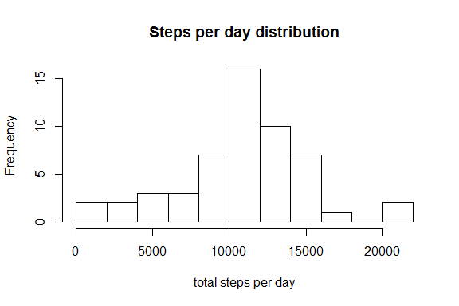
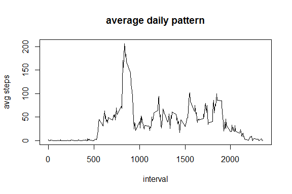
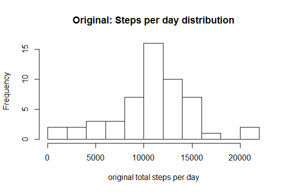
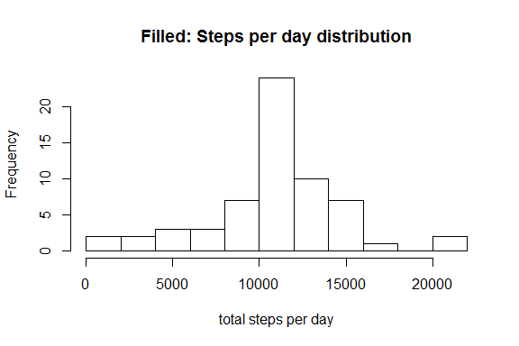

# Reproducible Research: Peer Assessment 1
Albert de Roos  
`r Sys.Date()`  

```r
library(dplyr)
library(ggplot2)
Sys.setlocale("LC_TIME", "English")
```


## Loading and preprocessing the data
The data file was unzipped using read.csv and the column with the dates was set to Date format. In order to get English-named weekdays, the locale on the machine was set to English_United States.1252


```r
myrepdata <- read.csv("activity.csv")
myrepdata$date <- as.Date(myrepdata$date)
str(myrepdata)
```

```
## 'data.frame':	17568 obs. of  3 variables:
##  $ steps   : int  NA NA NA NA NA NA NA NA NA NA ...
##  $ date    : Date, format: "2012-10-01" "2012-10-01" ...
##  $ interval: int  0 5 10 15 20 25 30 35 40 45 ...
```

## What is mean total number of steps taken per day?
In order to calculate the mean and median steps per day, first the data is grouped by the day and the sum per day is derived.


```r
stepsperday <- myrepdata %>% group_by(date) %>% summarize(sum = sum(steps))
str(stepsperday)
```

```
## Classes 'tbl_df', 'tbl' and 'data.frame':	61 obs. of  2 variables:
##  $ date: Date, format: "2012-10-01" "2012-10-02" ...
##  $ sum : int  NA 126 11352 12116 13294 15420 11015 NA 12811 9900 ...
```

This yields a new data frame with 61 days consistent with the number of days in the 2 months of the data collection. The histogram of the steps taken per day and the mean and median are shown below. 


```r
hist(stepsperday$sum, breaks = 15, xlab = "total steps per day", main = "Steps per day distribution")
```



```r
summary(stepsperday$sum)
```

```
##    Min. 1st Qu.  Median    Mean 3rd Qu.    Max.    NA's 
##      41    8841   10760   10770   13290   21190       8
```

## What is the average daily activity pattern?
For the average daily activity pattern, we group we data by time interval and then take the average of each time interval. We remove the NAN when we take the average. From the graph below we see the average daily pattern. The interval where we see the highest average steps. 


```r
stepsperinterval <- myrepdata %>%  group_by(interval) %>% summarize(avgsteps = mean(steps, na.rm = TRUE))
plot(stepsperinterval$interval, stepsperinterval$avgsteps, type = "l", main = "average daily pattern", xlab = "interval", ylab = "avg steps")
```



```r
stepsperinterval[which.max(stepsperinterval$avgsteps), ]
```

```
## Source: local data frame [1 x 2]
## 
##   interval avgsteps
##      (int)    (dbl)
## 1      835 206.1698
```
The interval where we see the highest average steps:


```r
stepsperinterval[which.max(stepsperinterval$avgsteps), ]
```

```
## Source: local data frame [1 x 2]
## 
##   interval avgsteps
##      (int)    (dbl)
## 1      835 206.1698
```

## Imputing missing values
There are missing values in the data as shown using a summary of the imported dataset

```r
sum(is.na(myrepdata$steps))
```

```
## [1] 2304
```

### Strategy and execution of imputing the missing values

The strategy for imputing missing values is based on filling in the average of the specific timeinterval. In the code, for every NA we encounter in the file, we first determine which interval it is, then we extract the average for this interval from a seerate set with averages. Finally, we replace the value with the average. The new dataset is called 'myrepdatafilled'. We see from the header of the file that the values have been replaced by the values of the average value for that interval:


```r
          myrepdatafilled <- myrepdata
          for (n in 1:nrow(myrepdatafilled)){
               if (is.na(myrepdatafilled[n, "steps"])) {
                    interval = myrepdatafilled[n,3]
                    interval_average <- stepsperinterval[stepsperinterval$interval == interval, ]
                    myrepdatafilled[n, 1] <- interval_average$avgsteps[[1]]
               }
          }
head(myrepdata, 5)
```

```
##   steps       date interval
## 1    NA 2012-10-01        0
## 2    NA 2012-10-01        5
## 3    NA 2012-10-01       10
## 4    NA 2012-10-01       15
## 5    NA 2012-10-01       20
```

```r
head(myrepdatafilled, 5)
```

```
##       steps       date interval
## 1 1.7169811 2012-10-01        0
## 2 0.3396226 2012-10-01        5
## 3 0.1320755 2012-10-01       10
## 4 0.1509434 2012-10-01       15
## 5 0.0754717 2012-10-01       20
```

```r
head(stepsperinterval, 5)
```

```
## Source: local data frame [5 x 2]
## 
##   interval  avgsteps
##      (int)     (dbl)
## 1        0 1.7169811
## 2        5 0.3396226
## 3       10 0.1320755
## 4       15 0.1509434
## 5       20 0.0754717
```

### Difference between the filled data and the original data

The next graphs show the distribution of the steps per time interval for the original data (see also earlier graph) and the data with the NAs filled in with the average. Althoung the number of measurements increased, the values for mean and median were not changed.


```r
          stepsperday <- myrepdata %>% group_by(date) %>% summarize(sum = sum(steps))
          hist(stepsperday$sum, breaks = 15, xlab = "original total steps per day", main = "Original: Steps per day distribution")
```



```r
          summary(stepsperday$sum)
```

```
##    Min. 1st Qu.  Median    Mean 3rd Qu.    Max.    NA's 
##      41    8841   10760   10770   13290   21190       8
```

```r
          stepsperdayfilled <- myrepdatafilled %>% group_by(date) %>% summarize(sum = sum(steps))
          hist(stepsperdayfilled$sum, breaks = 15, xlab = "total steps per day", main = "Filled: Steps per day distribution")
```



```r
          summary(stepsperdayfilled$sum)
```

```
##    Min. 1st Qu.  Median    Mean 3rd Qu.    Max. 
##      41    9819   10770   10770   12810   21190
```
          
## Are there differences in activity patterns between weekdays and weekends?

An extra column is first added to the original data that contains whether it is a weekday or a weekend day. This is done by checking whether the day of the week is a Monday-Friday.


```r
    myrepdataplus <- myrepdata
     weekdays1 <- c('Monday', 'Tuesday', 'Wednesday', 'Thursday', 'Friday')
     myrepdataplus$weekday <- factor((weekdays(myrepdataplus$date) %in% weekdays1), levels=c(FALSE, TRUE), labels=c('weekend', 'weekday'))
```

Then new plots were made where we distinguish between the weekday and the weekdn by using the facets in ggplot2. We see that the average number of steps start increasing earlier during weekdays and also starts decreasing earlier. Also there is a more dicreet peak in the data for the weekdays.

```r
     stepsperintervalplus <- myrepdataplus %>%  group_by(interval, weekday) %>% summarize(avgsteps = mean(steps, na.rm = TRUE))
     ggplot(data = stepsperintervalplus, aes(x = interval, y = avgsteps)) + 
               ggtitle("Average Daily Patterns Weekdays and Weekend") + ylab("Average Number of Steps") +
               facet_grid(weekday ~ .) +
               geom_line()          
```


